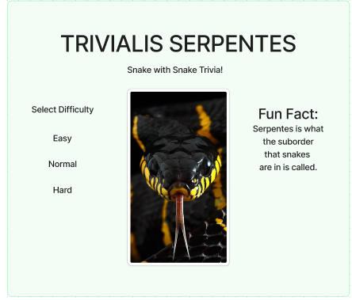
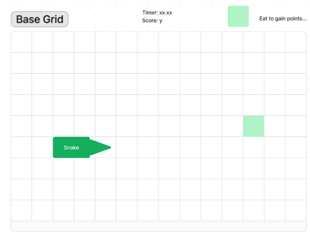
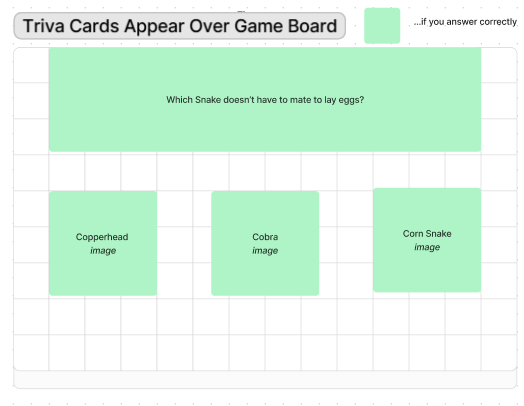
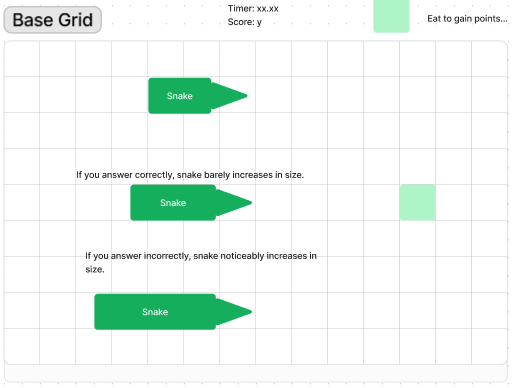
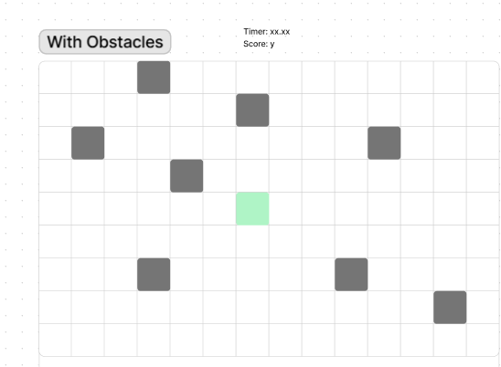
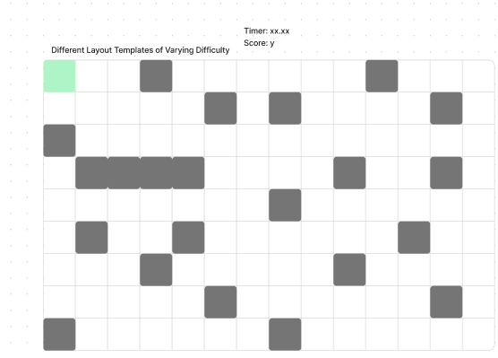
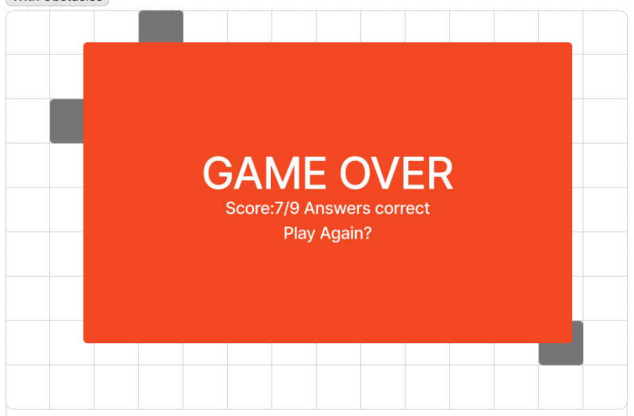
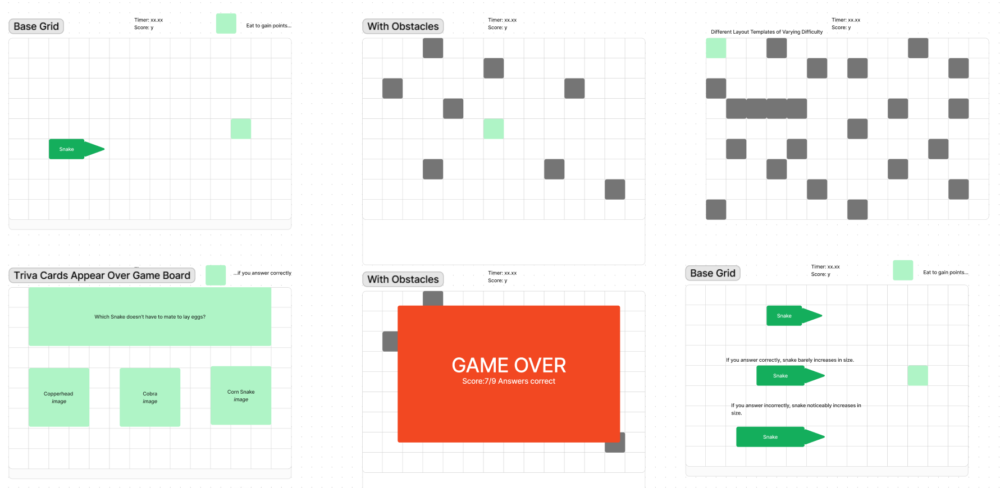

<!--  -->

 
# ***Trivialis-Serpentes***
The game of *Snake* with a Trivia *Twist*

# The Board


Just like the classic game of *snake*, ***Trivialis-Serpentes*** has a grid board for the *snake* to move around. Each grid square will have its own unique `id`. The *Snake* will be **controlled with the players arrow keys**, and is an `array` that will populate itself with `push()`. The *Snake* must eat the <span style ="color:#D1FFBD">*fruit*</span>, represented by the <span style ="color:#D1FFBD">green square</span>, to gain points. After being eaten, the <span style ="color:#D1FFBD">green square</span> will populate again on the grid in space not taken up by the *Snake*, or any other objects. But thats not all that happens when the *Snake* reaches the <span style ="color:#D1FFBD">green square</span>

# Snake Themed Trivia!



> To earn a point you must also answer a trivia question about *Snakes!*

 Each question will have three possible answers that can be selected. The answers will be shown on <cards> with both text and images to represent the *Snakes.* Each question and its answers will written with `arrays`inside of `objects` inside of `arrays`, like so:

```javascript
Const questions = [
{
    question: "Which Snake doesn't have to mate to lay eggs?",
    answers: ["CopperHead", "Cobra", "Corn Snake"],
    correct: "Corn Snake"
}
{
    question: "What do snakes smell with?",
    answers: ["Their Nose", "Through Their Skin", "Their Tongue"],
    correct: "Their Tongue"
}
]
```
To choose what question will be posed to the player, A `random.()` function will be used.

# The Reprecussions of a Wrong Answer



If you answer the trivia question correctly, then your snake will still grow, by at a small rate (snakeLength += 1). If you answer the question incorrectly, your snake ballons in size (snakeLength += 3), as shown in the image above. 


# Making the Board More Interesting



The user can select difficulty levels at the start which will add obstacles to the board which will make it more difficult to navigate. 



# Game over!



> Unfortunately, in life all things must come to an end. 

This game is no different. If your snake collides with any obstacle, itself, or the borders of the board you will be presented with a **Game Over** screen. You will be presented with your *score*, which is the amount of correct trivia answers you scored out of the total amount asked. Players will be prompted to play again, which will reset the game state.



# Credit


[Figma](https://figma.com) for creating the whiteboarding (and Kass for telling me about it!).

[ProProfs](https://www.proprofs.com/quiz-school/quizshow.php?title=hard-snake-quiz&q=7) for snake trivia.

[Peakpx](https://www.peakpx.com) for snake pictures

[freeCodeCamp](https://www.freecodecamp.org/news/how-to-shuffle-an-array-of-items-using-javascript-or-typescript/#:~:text=random()%2C%20you%20introduce%20a,method%20shuffles%20the%20array%20randomly.) For the shuffle function

[DiscoverDeadly](https://www.discoverdeadly.com.au/interesting-snake-facts) for snake trivia.

[NPS](https://www.nps.gov/gate/learn/nature/eastern-garter-snake.htm#:~:text=Unlike%20most%20snakes%2C%20garters%20do,f%20Gateway%20National%20Recreation%20Area.) for snake trivia

[JSTOR](https://www.jstor.org/stable/1446454?origin=crossref)

[Smithsonian's National Zoo & Conversation Biology Institute](https://nationalzoo.si.edu/animals/gaboon-viper#:~:text=Gaboon%20vipers%20are%20venomous.,fangs%20of%20any%20venomous%20snake.)