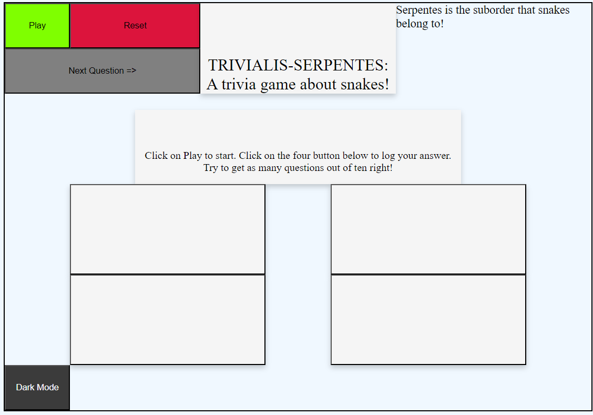

<!--  -->

 
# ***Trivialis-Serpentes***
*Snake* Trivia!


# Snake Themed Trivia!


> To earn a point you must also answer a trivia question about *Snakes!*

 Each question is multiple choice, with 4 possible answers. The answers will be shown on `<cards>`. Each question and its answers will written with `arrays`inside of `objects` inside of `arrays`, like so:

```javascript
Const questions = [
{
    question: "Which Snake doesn't have to mate to lay eggs?",
    answers: ["CopperHead", "Cobra", "Corn Snake"],
    correct: "Corn Snake"
}
{
    question: "What do snakes smell with?",
    answers: ["Their Nose", "Through Their Skin", "Their Tongue"],
    correct: "Their Tongue"
}
]
```
A `sort()` function will be used to shuffle the array before playing each round.

Try to score all ten out of ten!


# Credit


[Figma](https://figma.com) for creating the whiteboarding (and Kass for telling me about it!).

[ProProfs](https://www.proprofs.com/quiz-school/quizshow.php?title=hard-snake-quiz&q=7) for snake trivia.

[Peakpx](https://www.peakpx.com) for snake pictures

[freeCodeCamp](https://www.freecodecamp.org/news/how-to-shuffle-an-array-of-items-using-javascript-or-typescript/#:~:text=random()%2C%20you%20introduce%20a,method%20shuffles%20the%20array%20randomly.) for the shuffle function

[DiscoverDeadly](https://www.discoverdeadly.com.au/interesting-snake-facts) for snake trivia.

[NPS](https://www.nps.gov/gate/learn/nature/eastern-garter-snake.htm#:~:text=Unlike%20most%20snakes%2C%20garters%20do,f%20Gateway%20National%20Recreation%20Area.) for snake trivia

[JSTOR](https://www.jstor.org/stable/1446454?origin=crossref) for snake trivia

[Smithsonian's National Zoo & Conversation Biology Institute](https://nationalzoo.si.edu/animals/gaboon-viper#:~:text=Gaboon%20vipers%20are%20venomous.,fangs%20of%20any%20venomous%20snake.) for snake trivia

[wiseoceans](https://wiseoceans.com/creature-feature-friday-olive-sea-snake-copy/) for olive sea snake image

[Britannica](https://www.britannica.com/animal/Gaboon-viper) for gaboon image

[Canadian Herpetological Society](https://canadianherpetology.ca/species/species_page.html?cname=Red-sided%20Gartersnake) for garter snake image

[Medium](https://medium.com/globetrotters/a-deadly-venomous-black-mamba-snake-startled-me-in-south-africa-cb3129312b98) for black mamba image

[Slaying The Dragon](https://www.youtube.com/watch?v=EiNiSFIPIQE) for grid help.