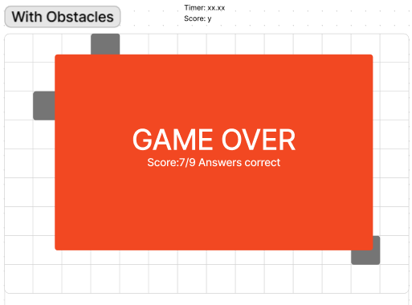

<!--  -->

 
# ***Trivialis-Serpentes***
The game of *Snake* with a Trivia *Twist*

# The Board


Just like the classic game of *snake*, ***Trivialis-Serpentes*** has a grid board for the *snake* to move around. The *Snake* must eat the *fruit*, represented by the green square, to gain points. However in this game, when the snake reaches the *fruit*  something else happens...

# Snake Themed Trivia!


> To earn a point you must also answer a trivia question about snakes!

 Each question will have three possible answers that can be selected. The answers will be shown on <cards> with both text and images to represent the snakes. Each question and its answers will written with `arrays`inside of `objects` inside of `arrays`, like so:

```javascript
Const questions = [
{
    question: "Which Snake doesn't have to mate to lay eggs?",
    answers: ["CopperHead", "Cobra", "Corn Snake"],
    correct: "Corn Snake"
}
{
    question: "What do snakes smell with?",
    answers: ["Their Nose", "Through Their Skin", "Their Tongue"],
    correct: "Their Tongue"
}
]
```

# The Reprecussions of a Wrong Answer


If you answer the trivia question correctly, then your snake will still grow, by at a small rate (snakeLength += 1). If you answer the question incorrectly, your snake ballons in size (snakeLength += 3), as shown in the image above. 


# Making the Board More Interesting


The user can select difficulty levels at the start which will add obstacles to the board which will make it more difficult to navigate. 


# Game over!



Unfortunately, all things must come to an end. This game is no different. If your snake collides with any obstacle, itself, or the borders of the board you will be presented with a **Game Over** screen. You will be presented with your *score*, which is the amount of correct trivia answers you scored out of the total amount asked. 


# Credit


[Figma](https://figma.com) for creating the whiteboarding (and Kass for telling me about it!).

[ProProfs](https://www.proprofs.com/quiz-school/quizshow.php?title=hard-snake-quiz&q=7) for snake trivia.

[Peakpx](https://www.peakpx.com) for snake pics

